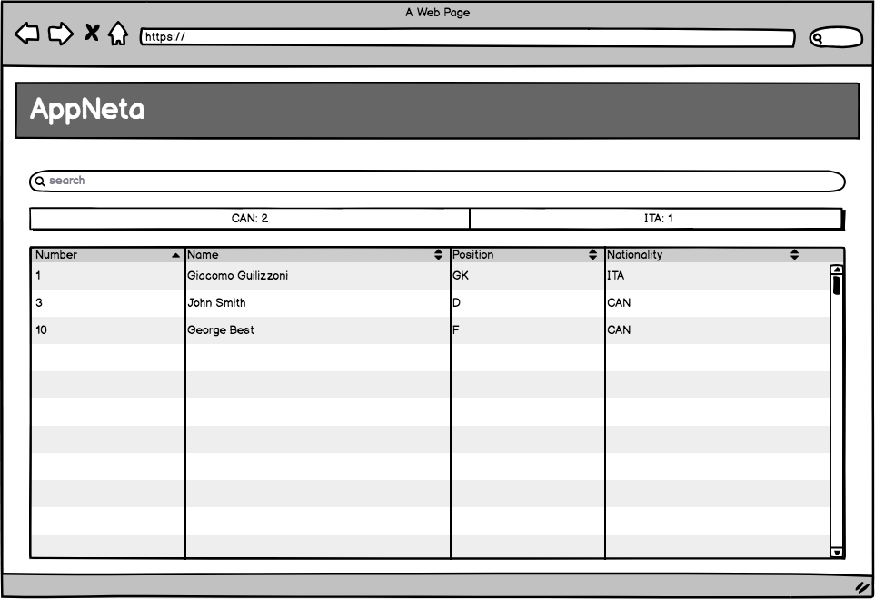

# Welcome!

Thank you for your interest in AppNeta. Please review the following instructions.

Inside this repo, you'll find the skeleton of a small web application - it consists of both a [server](./server/README.md) and a [client](./client/README.md). They both have some minimal functionality already, but we'd like you to enhance it as described below.

## Virtual Machine

To make things a little simpler, we provide a Virtual Machine that comes pre-installed with all of the required software:

* Ubuntu 16.04
* OpenJDK Java Development Kit 1.8
* Maven
* NodeJs 8 (And NPM 5)
* Git
* Visual Studio Code
* Chrome and Firefox browsers

The VM is intended to be used with [VirtualBox](https://www.virtualbox.org/) 5.

If you have a different editor preference, you are able to download and install it. This repo is already loaded onto the VM at `/home/appneta/test`. The VM is configured to automatically log in, but if needed the credentials are `appneta/appneta` (username/password).

The VM is configured to port forward the ports needed for the two components of the app (8080 and 3000) so you can use the browser on your own machine for testing, provided you can determine the IP of the guest machine.

## Server

The server is a [DropWizard](http://www.dropwizard.io/) application that contains a database and provides REST endpoints that can read data from it. There is also a supplied dataset (The current roster of the Vancouver Whitecaps MLS team - you can view all the data by opening the `players.csv` file). Once the server is running, you should be able to make a GET request (From the command line, a browser or a tool like Postman) to `http://localhost:8080/hello-world` in order to verify that everything is running.

What you'll need to do is:

* Add a new GET endpoint at `/players` which returns the current contents of the database
* Extend the returned model so that it includes all of the fields available in the dataset

We have already created the `PlayerDAO` class which exposes methods that can be used to load a player by ID or the full list via [Hibernate](http://hibernate.org/). The ID of a player is his shirt number. The fields in the dataset are described below:

| DB column  | Description                |
| ---------- | -------------------------- |
| number     | Shirt number (ID)          |
| name       | Name                       |
| nat        | Nationality                |
| pos        | Playing position           |
| height     | Height in M                |
| weight     | Weight in KG               |
| dob        | Date of Birth (YYYY-MM-DD) |
| birthplace | City of Birth              |

The README in the `server` folder has instructions on how to build and start the server.

## Client

The client is a [React](https://reactjs.org/) application. If you have a strong preference for a different UI library (e.g. Angular or Vue) you're welcome to use that too, but the setup is left up to you.

What you'll need to do is:

* Add code to read data from the `/players` endpoint you created on the server (You can use any libraries you like to call the API)
* Display the data from the endpoint in the form of a table
* The table should show all of the columns from the dataset
* The table should support sorting (This can be implemented either client-side or server-side). Sorting should match the data type of the column - some are text, some numeric and one is a date
* Add a search function to the table - this should be a simple text search, where the table is filtered down to the rows that contain the entered string in any field. This should be case-insensitive and match the filter string anywhere in the data (e.g. If I enter "aNC" it should match "Vancouver"). Again, this can be implemented on the client or server-side
* A summary/aggregation of player nationalities is shown between the search box and the table. This should show the different countries the currently visible players are from, along with a count (e.g. if two players are from USA and one from Brazil, "USA: 2 BRA: 1" will be displayed)
* The summary should stay up to date with the current search

When complete, the client should look like the wireframe below:

The README in the `client` folder has instructions on how to build and start the client.

## Submission

Please send in your code either by emailing a ZIP file, or by uploading to a GitHub or BitBucket repo and sending us the link. On the VM, the folder is already initialised as a Git repo, you'll need to configure Git with your identity and set the upstream repo to push to.
